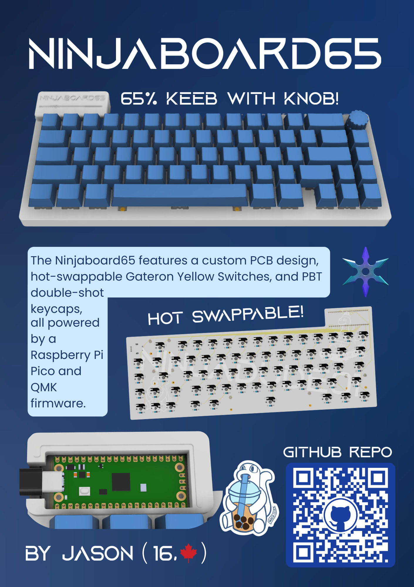

# Ninjaboard65

The Ninjaboard65 is a 65% custom keyboard with a knob! Features include hot-swappable gateron yellow switches, pbt double-shot keycaps, and 3d printed case + plate. It uses qmk firmware, which is fully customizable so you can assign each key to whatever function you want. I decided to build this project as I love hardware and am already familiar with the basics. I wanted a project that would challenge me, which is why I decided to make my own keyboard. 

# Zine

# Renders

# Layout 
I chose a 65% layout as I like to game in my freetime, and this layout is a perfect mix between everyday functionality while still being small and compact.

# Schematic
I designed the Schematic and PCB in Kicad, and chose to use a raspberry pi pico because it has many GPIO pins, making it perfect for my project as I needed 21 pins for my matrix + rotary encoder to work.

# PCB
I am very proud of my clean wiring, as it took me countless hours and I re-did it many times. I also added some cool designs to the backside silkscreen to add some unique flair to my project!

# Case
My Keyboard case was created in fusion, 

# Firmware

# BOM

|Item|Part Name         |Quantity|Description                    |Cost (USD)|Link                                                                                                                                                                                                                                                                                                                                                                                                                                                                                                                                                                                                                                                                                                                                                                                         |
|----|------------------|--------|-------------------------------|----------|---------------------------------------------------------------------------------------------------------------------------------------------------------------------------------------------------------------------------------------------------------------------------------------------------------------------------------------------------------------------------------------------------------------------------------------------------------------------------------------------------------------------------------------------------------------------------------------------------------------------------------------------------------------------------------------------------------------------------------------------------------------------------------------------|
|1   |Custom PCB        |5       |Printed Circut Board           |$20       |https://jlcpcb.com/                                                                                                                                                                                                                                                                                                                                                                                                                                                                                                                                                                                                                                                                                                                                                                          |
|2   |Kb Switches       |110     |Input                          |$32.05    |https://www.aliexpress.com/item/1005008397216226.html?spm=a2g0o.order_list.order_list_main.28.6a7d1802895Pzz                                                                                                                                                                                                                                                                                                                                                                                                                                                                                                                                                                                                                                                                                 |
|3   |Keycaps (Blue)    |133     |Protection                     |$13.64    |https://www.aliexpress.com/item/1005009580866548.html?spm=a2g0o.order_list.order_list_main.17.6a7d1802895Pzz#nav-specification                                                                                                                                                                                                                                                                                                                                                                                                                                                                                                                                                                                                                                                               |
|4   |Hot-swap Sockets  |110     |Allows hot-swapping of switches|$9.88     |https://www.aliexpress.com/item/1005007232040760.html?spm=a2g0o.order_list.order_list_main.5.6a7d1802895Pzz                                                                                                                                                                                                                                                                                                                                                                                                                                                                                                                                                                                                                                                                                  |
|5   |Rotary Encoder    |1       |You can rotate it              |$3.50     |https://www.digikey.ca/en/products/detail/alps-alpine/EC11E15244B2/19529170                                                                                                                                                                                                                                                                                                                                                                                                                                                                                                                                                                                                                                                                                                                  |
|6   |Encoder Knob cap  |1       |Protection                     |$4.25     |https://www.aliexpress.com/item/1005006531154080.html?spm=a2g0o.order_list.order_list_main.5.256d1802T4w9tK                                                                                                                                                                                                                                                                                                                                                                                                                                                                                                                                                                                                                                                                                  |
|7   |Raspberry pi pico |1       |Microcontroller                |$2.89     |https://www.digikey.ca/en/products/detail/raspberry-pi/SC0915/13684020                                                                                                                                                                                                                                                                                                                                                                                                                                                                                                                                                                                                                                                                                                                       |
|8   |Stabilizers       |8       |Increase steadiness of keys    |$7.86     |https://www.aliexpress.com/item/1005007236845004.html?spm=a2g0o.cart.0.0.722238daCCs9vH&mp=1&pdp_npi=6%40dis%21CAD%21CAD%2010.78%21CAD%2010.78%21%21CAD%2010.78%21%21%21%40210328c017745464960958122e1f40%2112000039909995531%21ct%21CA%217451194651%21%211%210%21                                                                                                                                                                                                                                                                                                                                                                                                                                                                                                                           |
|9   |Rubber Bumpers    |10      |Prevent sliding                |$3.78     |https://www.aliexpress.com/item/1005003881918836.html?spm=a2g0o.productlist.main.26.276a2cb9RSUSKP&algo_pvid=2cb2056c-1932-4d95-a10e-0f118e3ed9cb&algo_exp_id=2cb2056c-1932-4d95-a10e-0f118e3ed9cb-25&pdp                                                                                                                                                                                                                                                                                                                                                                                                                                                                                                                                                                                    |
|10  |M2 Heatset Inserts|100     |Threaded metal hole for screws |$5.76     |https://www.aliexpress.com/item/1005006838108683.html?spm=a2g0o.cart.0.0.1c1b38dalGfMuU&mp=1&pdp_npi=6%40dis%21CAD%21CAD%205.20%21CAD%205.20%21%21CAD%205.20%21%21%21%4021033d9d17760010503013922ef23d%2112000038467725083%21ct%21CA%217451194651%21%211%210%21                                                                                                                                                                                                                                                                                                                                                                                                                                                                                                                              |
|11  |M2 Screw 4mm      |50      |Screw                          |$1.70     |https://www.aliexpress.com/item/32973784147.html?spm=a2g0o.productlist.main.1.304apnmvpnmvhX&algo_pvid=8e4bcfb2-c0a1-48f2-ad5e-84593aa7934a&algo_exp_id=8e4bcfb2-c0a1-48f2-ad5e-84593aa7934a-0&pdp_ext_f=%7B%22order%22%3A%227855%22%2C%22spu_best_type%22%3A%22price%22%2C%22eval%22%3A%221%22%2C%22fromPage%22%3A%22search%22%7D&pdp_npi=6%40dis%21CAD%212.26%212.26%21%21%211.60%211.60%21%402101e2b417760020144634724ef5ec%2112000024189797294%21sea%21CA%217451194651%21X%211%210%21n_tag%3A-29912%3Bd%3A8fd05d1b%3Bm03_new_user%3A-29895&curPageLogUid=kvh1vbqAtJaq&utparam-url=scene%3Asearch%7Cquery_from%3A%7Cx_object_id%3A32973784147%7C_p_origin_prod%3A                                                                                                                         |
|12  |1N4148 Diodes     |100     |Prevent kb switch ghosting     |$1.73     |https://www.aliexpress.com/item/1005004962400215.html?spm=a2g0o.productlist.main.8.314c7Zzp7Zzp1O&aem_p4p_detail=202604120710367250743856096580001658181&algo_pvid=9a5c0ddc-1bdb-4d52-bd69-b6aeb1a7dc6b&algo_exp_id=9a5c0ddc-1bdb-4d52-bd69-b6aeb1a7dc6b-7&pdp_ext_f=%7B%22order%22%3A%222280%22%2C%22spu_best_type%22%3A%22price%22%2C%22eval%22%3A%221%22%2C%22fromPage%22%3A%22search%22%7D&pdp_npi=6%40dis%21CAD%212.39%212.39%21%21%211.69%211.69%21%402101e83017760030363003545e4ed8%2112000031168735020%21sea%21CA%217451194651%21X%211%210%21n_tag%3A-29912%3Bd%3A8fd05d1b%3Bm03_new_user%3A-29895&curPageLogUid=O5tBJUtwCY0i&utparam-url=scene%3Asearch%7Cquery_from%3A%7Cx_object_id%3A1005004962400215%7C_p_origin_prod%3A&search_p4p_id=202604120710367250743856096580001658181_4|
